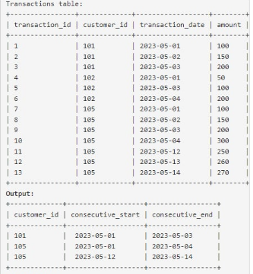
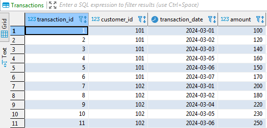
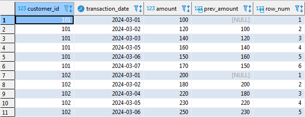
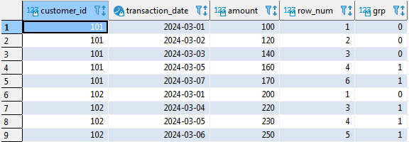
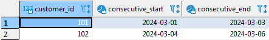

# Window-Functions-in-SQL


## I. What is the difference between aggregate functions and window functions ?
### 1. Aggregate functions
- Usage:
  - Used to summarize data: sum, average, count, etc.
  - Combine multiple rows into one row based on **GROUP BY**
- Some popular aggregate functions: **SUM()**, **AVG()**, **COUNT()**, **MAX()**, **MIN()**

For example we have a table named **Sales** as follows:

|customer|amount|
|--------|------|
|A|100|
|A|150|
|B|200|
|B|250|
|C|300|
```sql
SELECT customer, SUM(amount) as total_amount
FROM Sales
GROUP BY customer;
```
And the result will be like this:

|customer|total_amount|
|--------|------------|
|A|250|
|B|450|
|C|300|

=> Each customer now has only one line and we no longer see individual transactions.

### 2. Window functions
- Usage:
  - Used to calculate on a row "window" related to the current row, but does not merge the data.
  - The data remains row by row, only the calculated columns are added.
- Some popular window functions:
  - **ROW_NUMBER()**, **RANK()**, **DENSE_RANK()**
  - **SUM() OVER(...)**, **AVG() OVER(...)*** => Can be used with the aggregate functions.
  
For instance, we still have a table named **Sales**
```sql
SELECT customer,
       amount,
       SUM(amount) OVER (PARTITION BY customer) AS total_per_customer
FROM Sales;
```
The result:
|customer|amount|total_per_customer|
|--------|------|------------------|
|A|100|250|
|A|150|250|
|B|200|450|
|B|250|450|
|C|300|300|

=> Still has full transction lines, but has added total column for each customer.

After understanding the difference between these two functions, we will try to make an example of how to apply Window Functions to extract data.

## II. Problem
We have a problem as follows: There is a table named **Transactions** with the following information:


With the request is to write an SQL query to find the customers who have made consecutive transactions with the increasing amount for at least three consecutive days. Include the customer_id, start date of the consecutive transactions period and the end date of the consecutive transactions period. There can be multiple consecutive transactions by a customer. Return the result table ordered by customer_id in ascending order.

The table and the output must be like this:



To create a database source for the above problem, I will use two tools: **SQL Server** and **Dbeaver**. Specifically, I will use Database Management Tool - **Dbeaver**, to connect to **SQL Server**. 

|||
|:--:|:--:|
|**Microsoft SQL Server (RDBMS)**|**DBeaver (Database Management Tool)**|

Then create a new database named **TransactionsDB**. In this database, I will create table with the code:
```sql
CREATE TABLE Transactions (
    transaction_id INT PRIMARY KEY,
    customer_id INT,
    transaction_date DATE,
    amount DECIMAL(10,2)
)
```
After the **Transactions** data table has been created, I will proceed to insert data into it:
```sql
INSERT INTO Transactions (transaction_id, customer_id, transaction_date, amount) VALUES 
(1, 101, '2024-03-01', 100),
(2, 101, '2024-03-02', 120),
(3, 101, '2024-03-03', 140),
(4, 101, '2024-03-05', 160),
(5, 101, '2024-03-06', 150),
(6, 101, '2024-03-07', 170),
(7, 102, '2024-03-01', 200),
(8, 102, '2024-03-02', 180),
(9, 102, '2024-03-04', 220),
(10, 102, '2024-03-05', 230),
(11, 102, '2024-03-06', 250);
```
The table **Transactions** will appear like this:



Next, I will proceed to extract data according to the requirements of the problem as follows:
```sql
WITH Ranked_Transactions AS (
    SELECT 
        customer_id, 
        transaction_date, 
        amount,
        LAG(amount) OVER (PARTITION BY customer_id ORDER BY transaction_date) AS prev_amount,
        ROW_NUMBER() OVER (PARTITION BY customer_id ORDER BY transaction_date) AS row_num
    FROM Transactions
),

Grouped_Transactions AS (
    SELECT 
        customer_id, 
        transaction_date, 
        amount, 
        row_num, 
        DATEDIFF(DAY, '2024-03-01', transaction_date) - (row_num - 1) AS grp
    FROM Ranked_Transactions
    WHERE prev_amount IS NULL OR amount > prev_amount
),

Final_Result AS (
    SELECT 
        customer_id, 
        MIN(transaction_date) AS consecutive_start, 
        MAX(transaction_date) AS consecutive_end
    FROM Grouped_Transactions
    GROUP BY customer_id, grp
    HAVING COUNT(*) >= 3
)
SELECT * 
FROM Final_Result
ORDER BY customer_id;
```
This code consists of 3 main parts, I will start with the first part:
### 1. CTE: Ranked_Transactions
```sql
WITH Ranked_Transactions AS (
    SELECT 
        customer_id, 
        transaction_date, 
        amount,
        LAG(amount) OVER (PARTITION BY customer_id ORDER BY transaction_date) AS prev_amount,
        ROW_NUMBER() OVER (PARTITION BY customer_id ORDER BY transaction_date) AS row_num
    FROM Transactions
)
```
Usage:
- Create 2 extra columns:
  - *prev_amount* : get the amount value of the previous transactions (use LAG() - this is also a Window Function)
  - *row_num* : number the transactions order by the time for each customer (PARTITION by customer_id)
    
The result after running this code section:



### 2. CTE: Grouped_Transactions
```sql
Grouped_Transactions AS (
    SELECT 
        customer_id, 
        transaction_date, 
        amount, 
        row_num, 
        DATEDIFF(DAY, '2024-03-01', transaction_date) - (row_num - 1) AS grp
    FROM Ranked_Transactions
    WHERE prev_amount IS NULL OR amount > prev_amount
)
```
Usage:
- Filter out transactions where amount is increasing (amount > prev_amount). If it is the first transaction (prev_amount is null), it is also kept.
- Calculate grp to group consecutive dates:
  - DATEDIFF(DAY,'2024-03-01', transaction_date,) produces the day number.
  - Subtract row_num - 1 to group consecutively increasing days into the same group.
    
=> **grp is a useful tip to group consecutively increasing rows**

The result after running the first two code sections:



### 3.CTE: Final_Result
```sql
Final_Result AS (
    SELECT 
        customer_id, 
        MIN(transaction_date) AS consecutive_start, 
        MAX(transaction_date) AS consecutive_end
    FROM Grouped_Transactions
    GROUP BY customer_id, grp
    HAVING COUNT(*) >= 3;
)
```
Usage:
- For each customer_id and grp, find:
  - Start date (MIN(transaction_date))
  - End date (MAX(transaction_date))
- Keep only series with 3 or more consecutive days increasing (HAVING COUNT(*) >=3).
  
The result:



Finally, we have obtained the necessary data based on the problem requirements. 

This is a very difficult problem as it applies many advanced SQL techniques, specifically CTE and Window Functions, to extract the required data. Through this problem, we can understand how common Window Functions work and can flexibly apply them in different situations.
