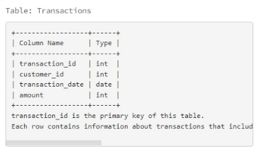

# Window-Functions-in-SQL


## I. What is the difference between aggregate functions and window functions ?
### 1. Aggregate functions
- Usage:
  - Used to summarize data: sum, average, count, etc.
  - Combine multiple rows into one row based on **GROUP BY**
- Some popular aggregate functions: **SUM()**, **AVG()**, **COUNT()**, **MAX()**, **MIN()**

For example we have a table named **Sales** as follows:

|customer|amount|
|--------|------|
|A|100|
|A|150|
|B|200|
|B|250|
|C|300|
```sql
SELECT customer, SUM(amount) as total_amount
FROM Sales
GROUP BY customer;
```
And the result will be like this:

|customer|total_amount|
|--------|------------|
|A|250|
|B|450|
|C|300|

=> Each customer now has only one line and we no longer see individual transactions.

### 2. Window functions
- Usage:
  - Used to calculate on a row "window" related to the current row, but does not merge the data.
  - The data remains row by row, only the calculated columns are added.
- Some popular window functions:
  - **ROW_NUMBER()**, **RANK()**, **DENSE_RANK()**
  - **SUM() OVER(...)**, **AVG() OVER(...)*** => Can be used with the aggregate functions.
  
For instance, we still have a table named **Sales**
```sql
SELECT customer,
       amount,
       SUM(amount) OVER (PARTITION BY customer) AS total_per_customer
FROM Sales;
```
The result:
|customer|amount|total_per_customer|
|--------|------|------------------|
|A|100|250|
|A|150|250|
|B|200|450|
|B|250|450|
|C|300|300|

=> Still has full transction lines, but has added total column for each customer.

After understanding the difference between these two functions, we will try to make an example of how to apply Window Functions to extract data.

## II. Problem
We have a problem as follows: There is a table named **Transactions** with the following information:


With the request is to write an SQL query to find the customers who have made consecutive transactions with the increasing amount for at least three consecutive days. Include the customer_id, start date of the consecutive transactions period and the end date of the consecutive transactions period. There can be multiple consecutive transactions by a customer. Return the result table ordered by customer_id in ascending order.

